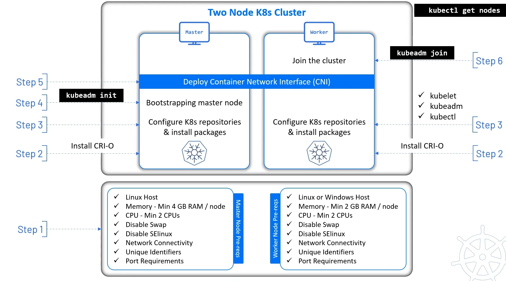

<span style="color:#4caf50;"><b>Created:</b> 2025-07-08</span> | <span style="color:#ff9800;"><b>Updated:</b> 2025-07-08</span> | <span style="color:#2196f3;"><b>Author:</b> Gouse Shaik</span>

---
 
### **1. Infra Readiness**

> _Provision VM or physical machines with minimum: 2 vCPU, 4GB RAM, 20GB disk_

-  Assign **unique hostnames** and **static IPs**
-  Ensure **NTP/time sync** is active (chronyd or systemd-timesyncd)

### **2. Open Required Network Ports (Firewall / Security Groups)**

> _Critical: Must be done **before** kubeadm runs. These are required for node registration, etcd, kubelet API._
#### 🔹 Master Node Inbound Ports:

|Port|Purpose|
|---|---|
|`6443`|Kubernetes API server|
|`2379-2380`|etcd client & peer|
|`10250`|Kubelet API|
|`10257`|Controller manager|
|`10259`|Scheduler|
|`10256`|kube-proxy (for service LB)|
#### 🔹 Worker Node Inbound Ports:

|Port|Purpose|
|---|---|
|`10250`|Kubelet API|
|`30000–32767`|NodePort services|
|`10256`|kube-proxy|

> 🧠 _First Principle_: A distributed system is **communication-first**. Blocked ports = broken cluster.

### **3. Bootstrap OS Configuration (All Nodes)**

> _Use this script on all nodes (master + workers)_

```bash
#!/bin/bash
set -e

# Disable swap
swapoff -a
sed -i '/ swap / s/^/#/' /etc/fstab

# Set hostnames (optional)
# hostnamectl set-hostname master-node-1 or worker-node-1

# Enable required kernel modules
modprobe br_netfilter
modprobe overlay

# System-level networking configs
tee /etc/sysctl.d/k8s.conf <<EOF
net.bridge.bridge-nf-call-ip6tables = 1
net.bridge.bridge-nf-call-iptables = 1
net.ipv4.ip_forward = 1
EOF
sysctl --system

# Install containerd
apt update && apt install -y containerd
mkdir -p /etc/containerd
containerd config default | tee /etc/containerd/config.toml > /dev/null
sed -i 's/SystemdCgroup = false/SystemdCgroup = true/' /etc/containerd/config.toml
systemctl restart containerd
systemctl enable containerd

# Install kubeadm, kubelet, kubectl
apt install -y apt-transport-https ca-certificates curl
curl -fsSL https://packages.cloud.google.com/apt/doc/apt-key.gpg | gpg --dearmor -o /usr/share/keyrings/k8s-archive-keyring.gpg
echo "deb [signed-by=/usr/share/keyrings/k8s-archive-keyring.gpg] https://apt.kubernetes.io/ kubernetes-xenial main" > /etc/apt/sources.list.d/kubernetes.list
apt update
apt install -y kubelet kubeadm kubectl
apt-mark hold kubelet kubeadm kubectl
```
### **4. Initialize Master Node**

> _Run on master node only_

```bash
kubeadm init \
  --pod-network-cidr=10.244.0.0/16 \
  --apiserver-advertise-address=<MASTER_NODE_IP>
```
Copy the `kubeadm join` command at the end.
### **5. Configure `kubectl` on Master**
```bash
mkdir -p $HOME/.kube
cp /etc/kubernetes/admin.conf $HOME/.kube/config
chown $(id -u):$(id -g) $HOME/.kube/config
```
### **6. Install Pod Network Add-on (e.g., Flannel)**
```bash
kubectl apply -f https://raw.githubusercontent.com/flannel-io/flannel/master/Documentation/kube-flannel.yml
```

> You’ll see node change from `NotReady` to `Ready`.
### **7. Join Worker Nodes**

> _Run the saved `kubeadm join` command from step 4 on each worker node_

```bash
kubeadm join <MASTER_IP>:6443 --token ... --discovery-token-ca-cert-hash sha256:...
```
### **8. Verify Cluster**
```bash
kubectl get nodes -o wide
kubectl get pods -A
```
You should see all nodes in `Ready` state and `kube-system` pods running.

---
## 🧠 Critical Checkpoints

|Checkpoint|Why it Matters|
|---|---|
|Ports opened **first**|Else `kubeadm join` or API calls silently fail|
|Swap disabled **before kubelet runs**|Prevents runtime crashes and cgroup failures|
|Containerd uses `SystemdCgroup=true`|Aligns with kubelet's expectations|
|Network add-on installed **after init**|Else Pods stuck in `ContainerCreating`|
|Hostname and IP consistency|Prevents kubelet re-registration or duplication|
|Static IP or reservation via DHCP|Prevents cluster break after reboot|
## 📦 Optional (Post Setup)

- Install **metrics-server**: `kubectl apply -f https://github.com/kubernetes-sigs/metrics-server/releases/latest/download/components.yaml`
- Install **Ingress**: NGINX or Traefik
- Setup **RBAC**, **PSA**, **audit logs**, **cert-manager**

---

Let me know if you want:

- Air-gapped version of the setup
    
- HA control plane (with stacked etcd or external)
    
- Ansible script to automate all of the above
    

Your infra. Your control. No fluff.