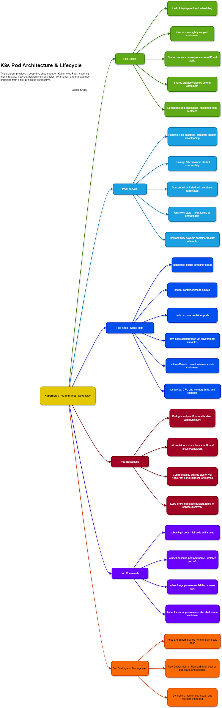

<b>Created:</b> 2025-07-06 | <b>Updated:</b> 2025-07-06 | <b>Author:</b> Gouse Shaik

This diagram provides a deep-dive cheat sheet on Kubernetes Pods, covering their structure, lifecycle, networking, spec fields, commands, and management principles from a first-principles perspective..

 
