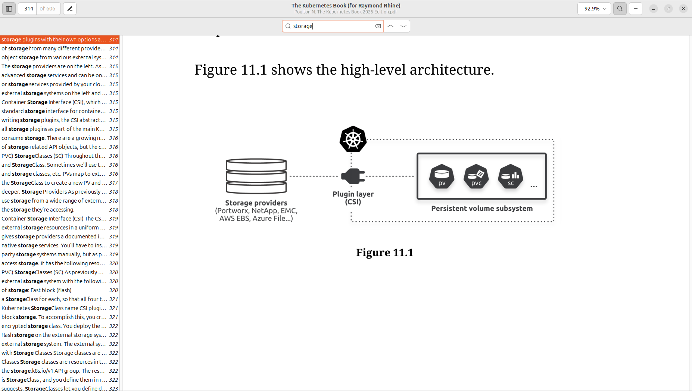

<span style="color:#4caf50;"><b>Created:</b> 2025-06-22</span> | <span style="color:#ff9800;"><b>Updated:</b> 2025-07-06</span> | <span style="color:#2196f3;"><b>Author:</b> Gouse Shaik</span>

- Storage providers
- Container Storage Interface (CSI)
- The Kubernetes persistent volume subsystem
- Dynamic provisioning with Storage Classes
 

### 📦 Kubernetes Storage Types Comparison

| **Type**        | **Access Mode**     | **Description**                                                                  | **Example Use Case**                       | **Example**                                       |
| --------------- | ------------------- | -------------------------------------------------------------------------------- | ------------------------------------------ | ------------------------------------------------- |
| **emptyDir**    | Pod-level only      | Ephemeral storage shared by containers in the same pod.                          | Caching/temp files during pod lifetime     | `emptyDir: {}` in pod spec                        |
| **hostPath**    | Node-level only     | Mounts a file/dir from host node into the pod.                                   | Accessing logs or shared folders on node   | `hostPath: /data/logs`                            |
| **NFS**         | ReadWriteMany (RWX) | Network File System — shared, file-based storage.                                | Shared configs, data between multiple pods | `nfs: { server: 10.0.0.1, path: "/data" }`        |
| **Longhorn**    | RWO, ROX, RWX       | Distributed block storage with replication, snapshot, backup.                    | Stateful apps needing HA volumes           | `storageClassName: longhorn` in PVC               |
| **CSI (Cloud)** | Varies              | Cloud-native block/file storage via Container Storage Interface.                 | Cloud apps needing persistent volumes      | `storageClassName: gp2` (AWS), `premium` (Azure)  |
| **Local PV**    | Node-local          | Directly uses disks on the Kubernetes node.                                      | Performance-heavy workloads                | `local: { path: /mnt/disks/ssd1 }`                |
| **GlusterFS**   | RWX                 | Distributed, scalable file storage system.                                       | Shared volumes across pods/nodes           | `glusterfs: { endpoints: ..., path: /data }`      |
| **Ceph RBD/FS** | RWO, RWX            | Ceph RBD (block), CephFS (file) storage. Scalable & reliable for prod workloads. | DBs or shared file workloads               | `rbd: { monitors: [...], pool: ..., image: ... }` |
| **iSCSI**       | RWO                 | Raw block storage via iSCSI protocol.                                            | Legacy storage integration                 | `iscsi: { targetPortal: ..., iqn: ..., lun: 0 }`  |
Here’s a clear comparison of **Block**, **Network (File/Shared)**, **Local**, and **CephFS** storage types:

|**Storage Type**|**Description**|**Use Case**|**Access Type**|**Examples**|
|---|---|---|---|---|
|**Block Storage**|Raw storage volumes presented as disks to OS or containers.|Databases, VMs, apps needing fast, low-latency storage|ReadWriteOnce (usually)|Longhorn, AWS EBS, iSCSI|
|**Network File Storage** (NFS, GlusterFS)|Shared storage accessed over network as file system.|Shared configs, logs, or data across pods|ReadWriteMany|NFS, GlusterFS, CephFS|
|**Local Storage**|Storage physically attached to node (host).|Fast access, node-specific data|ReadWriteOnce|hostPath, local PV|
|**CephFS**|Distributed POSIX-compliant file system on Ceph cluster.|Shared storage with high availability|ReadWriteMany|CephFS|
### Key Differences:

- **Block Storage** acts like a virtual disk, fast and low-level, but typically mounted by one pod at a time.
    
- **Network File Storage** allows multiple pods to read/write simultaneously over the network.
    
- **Local Storage** is node-specific, fast but tied to that node only.
    
- **CephFS** combines distributed file system features with scalability and high availability.


# PVC + PV manifest examples

### 🧪 1. `emptyDir` (Ephemeral)

```yaml
apiVersion: v1
kind: Pod
metadata:
  name: emptydir-example
spec:
  containers:
    - name: app
      image: nginx
      volumeMounts:
        - name: cache
          mountPath: /cache
  volumes:
    - name: cache
      emptyDir: {}
```

---

### 🏠 2. `hostPath`

```yaml
apiVersion: v1
kind: Pod
metadata:
  name: hostpath-example
spec:
  containers:
    - name: app
      image: nginx
      volumeMounts:
        - name: host-vol
          mountPath: /data
  volumes:
    - name: host-vol
      hostPath:
        path: /mnt/data
        type: Directory
```

---

### 🌐 3. `NFS`

```yaml
apiVersion: v1
kind: PersistentVolume
metadata:
  name: nfs-pv
spec:
  capacity:
    storage: 1Gi
  accessModes:
    - ReadWriteMany
  nfs:
    server: 10.0.0.100
    path: /exports/data
---
apiVersion: v1
kind: PersistentVolumeClaim
metadata:
  name: nfs-pvc
spec:
  accessModes:
    - ReadWriteMany
  resources:
    requests:
      storage: 1Gi
```

---

### 🐂 4. `Longhorn`

```yaml
apiVersion: v1
kind: PersistentVolumeClaim
metadata:
  name: longhorn-pvc
spec:
  accessModes:
    - ReadWriteOnce
  storageClassName: longhorn
  resources:
    requests:
      storage: 2Gi
```

---

### ☁️ 5. Cloud CSI (AWS EBS example)

```yaml
apiVersion: v1
kind: PersistentVolumeClaim
metadata:
  name: aws-ebs-pvc
spec:
  accessModes:
    - ReadWriteOnce
  storageClassName: gp2
  resources:
    requests:
      storage: 5Gi
```

---

### 📍 6. Local PV

```yaml
apiVersion: v1
kind: PersistentVolume
metadata:
  name: local-pv
spec:
  capacity:
    storage: 10Gi
  accessModes:
    - ReadWriteOnce
  persistentVolumeReclaimPolicy: Retain
  local:
    path: /mnt/disks/ssd1
  nodeAffinity:
    required:
      nodeSelectorTerms:
        - matchExpressions:
            - key: kubernetes.io/hostname
              operator: In
              values:
                - node-name
---
apiVersion: v1
kind: PersistentVolumeClaim
metadata:
  name: local-pvc
spec:
  accessModes:
    - ReadWriteOnce
  resources:
    requests:
      storage: 10Gi
```

### 🧱 7. Ceph RBD (Block Storage)

```yaml
apiVersion: v1
kind: Secret
metadata:
  name: ceph-secret
type: kubernetes.io/rbd
data:
  key: <base64-encoded-ceph-key>
---
apiVersion: v1
kind: PersistentVolume
metadata:
  name: ceph-rbd-pv
spec:
  capacity:
    storage: 5Gi
  accessModes:
    - ReadWriteOnce
  rbd:
    monitors:
      - 10.0.0.1:6789
    pool: kube
    image: rbd-vol
    user: admin
    secretRef:
      name: ceph-secret
    fsType: ext4
  persistentVolumeReclaimPolicy: Retain
---
apiVersion: v1
kind: PersistentVolumeClaim
metadata:
  name: ceph-rbd-pvc
spec:
  accessModes:
    - ReadWriteOnce
  resources:
    requests:
      storage: 5Gi
```

---

### 📂 8. CephFS (File Storage)

```yaml
apiVersion: v1
kind: PersistentVolume
metadata:
  name: cephfs-pv
spec:
  capacity:
    storage: 5Gi
  accessModes:
    - ReadWriteMany
  cephfs:
    monitors:
      - 10.0.0.1:6789
    path: /
    user: admin
    secretRef:
      name: ceph-secret
    readOnly: false
  persistentVolumeReclaimPolicy: Retain
---
apiVersion: v1
kind: PersistentVolumeClaim
metadata:
  name: cephfs-pvc
spec:
  accessModes:
    - ReadWriteMany
  resources:
    requests:
      storage: 5Gi
```

---

### 📡 9. GlusterFS

```yaml
apiVersion: v1
kind: PersistentVolume
metadata:
  name: gluster-pv
spec:
  capacity:
    storage: 5Gi
  accessModes:
    - ReadWriteMany
  glusterfs:
    endpoints: gluster-cluster
    path: myvol
    readOnly: false
---
apiVersion: v1
kind: Endpoints
metadata:
  name: gluster-cluster
subsets:
  - addresses:
      - ip: 10.0.0.2
    ports:
      - port: 1
---
apiVersion: v1
kind: PersistentVolumeClaim
metadata:
  name: gluster-pvc
spec:
  accessModes:
    - ReadWriteMany
  resources:
    requests:
      storage: 5Gi
```

---

### 💿 10. iSCSI

```yaml
apiVersion: v1
kind: PersistentVolume
metadata:
  name: iscsi-pv
spec:
  capacity:
    storage: 5Gi
  accessModes:
    - ReadWriteOnce
  iscsi:
    targetPortal: 10.0.0.10:3260
    iqn: iqn.2023-04.com.example:storage.disk1
    lun: 0
    fsType: ext4
    readOnly: false
  persistentVolumeReclaimPolicy: Retain
---
apiVersion: v1
kind: PersistentVolumeClaim
metadata:
  name: iscsi-pvc
spec:
  accessModes:
    - ReadWriteOnce
  resources:
    requests:
      storage: 5Gi
```

