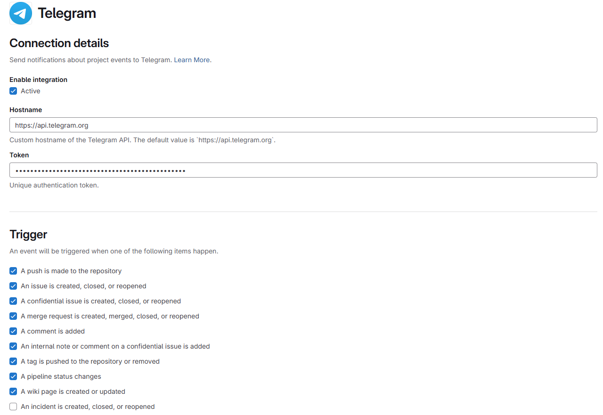
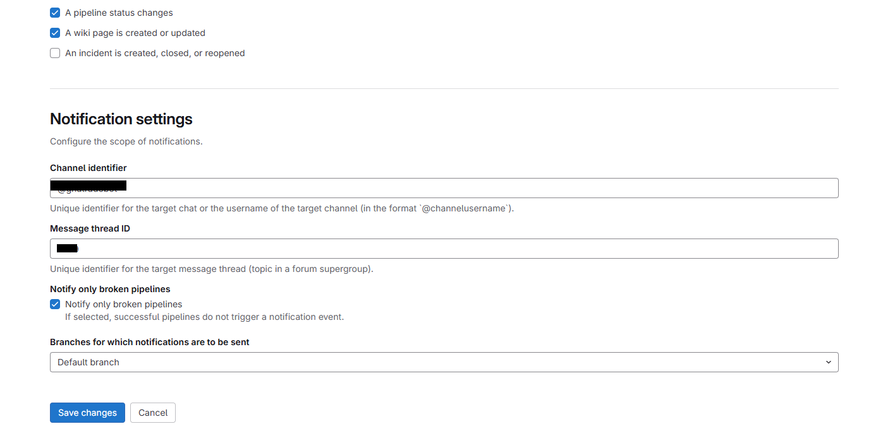

To add your Telegram bot to a **group** or **channel**, follow the steps below:

---
### ✅ For a **Telegram Group**:

1. **Create a Group** or use an existing one.
2. **Open group settings** → Tap group name at the top.
3. Tap **"Add Members"** or **"Invite Members"**.
4. Search for your bot by its username (e.g. `@my_devops_bot`).
5. **Add the bot to the group**.
6. (Optional but recommended): Promote it to **admin**:
    - Go to **Group Settings → Administrators**
    - Select your bot → Enable `Post messages`

---
### ✅ For a **Telegram Channel**:

1. **Create a Channel** or open an existing one.
2. Tap the channel name → **"Administrators"**.
3. Tap **"Add Admin"**.
4. Search and select your bot (e.g. `@my_devops_bot`).
5. Enable **“Post messages”** permission.
6. Tap **Save**.

> ⚠️ **Important:** Telegram bots cannot receive messages unless they're added to a group or channel **and promoted as admin** with post permission.

---
### ✅ To Confirm It Works:

Use this API with your bot token:

```bash
curl "https://api.telegram.org/bot<YOUR_BOT_TOKEN>/getUpdates"
```

Then send a message in the group/channel. You'll see the **chat ID** in the API response.

---
Yes, you can use a **Topic** (a.k.a. **message thread**) in a Telegram **Group** to organize bot messages — especially useful in **groups with Topics enabled** (like **forum-style groups**).

---
### ✅ How It Works

In Telegram **supergroups** with **Topics enabled**, each topic has a **thread ID** (message thread ID). Telegram bots can send messages into **a specific topic/thread** by setting:

```json
"message_thread_id": <thread_id>
```

---
### ✅ How to Use It in GitLab Integration

In GitLab’s **Telegram Integration UI**:

|Field|What to Enter|
|---|---|
|**Channel Identifier**|Group chat ID (e.g. `-1001234567890`)|
|**Message Thread ID**|Thread/Topic ID (e.g. `22`)|
This will direct GitLab messages to **that specific topic/thread** in the group.

---
### ✅ How to Get the Thread ID

You need to:

1. Add your bot to the group (as admin).
2. Send a message in the desired topic/thread.
3. Run:
```bash
curl https://api.telegram.org/bot<YOUR_BOT_TOKEN>/getUpdates
```

4. Find the `message_thread_id` in the response:
```json
"message_thread_id": 22,
"chat": {
  "id": -1001234567890,
  ...
}
```

---
gitlab integration configuration snapshots



